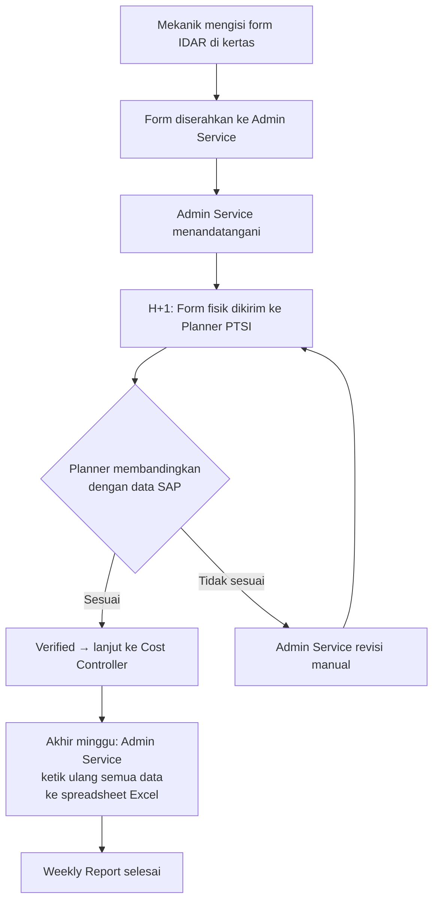
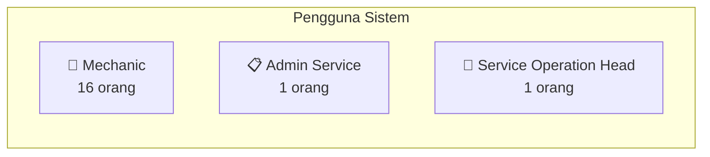
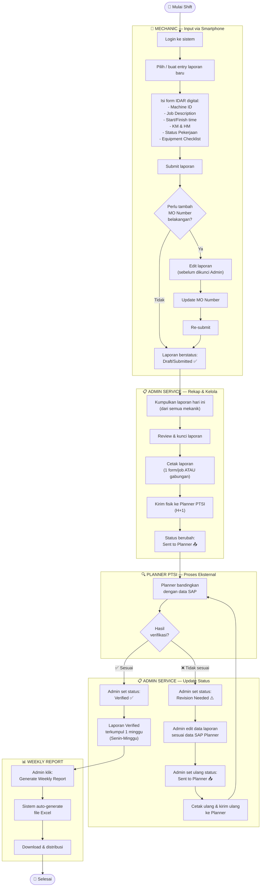
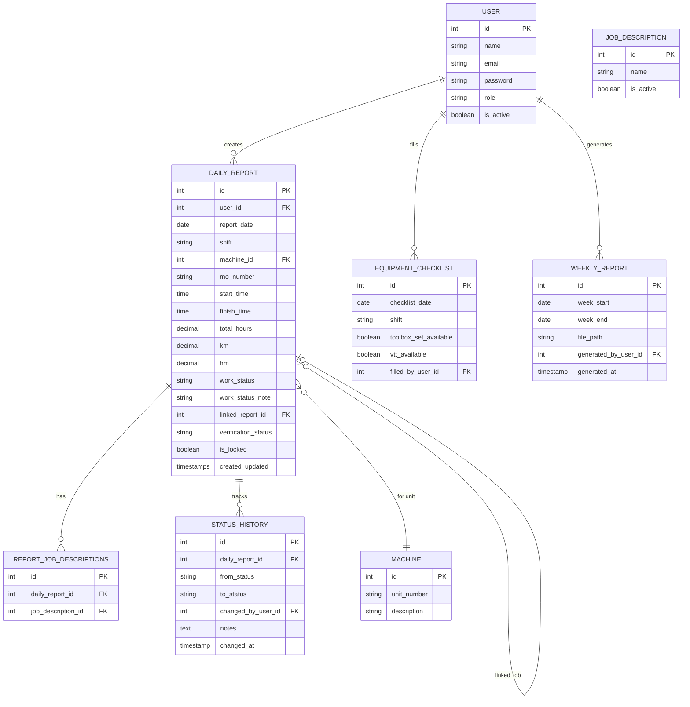

# PRD — Aplikasi Daily Routine
## PT IndoTruck Utama

| Metadata | Detail |
|---|---|
| **Versi Dokumen** | 1.0 |
| **Tanggal** | 6 Oktober 2026 |
| **Penulis** | Business Analyst / Product Manager |
| **Status** | Draft — Menunggu Review Stakeholder |
| **Pemohon** | Service Operation Head, PT IndoTruck Utama |
| **Model Pengembangan** | Solo Developer (Freelance / Vibe Coding — AI-Assisted) |

---

## Daftar Isi

1. [Executive Summary](#1-executive-summary)
2. [Problem Statement & Background](#2-problem-statement--background)
3. [Goals & Objectives](#3-goals--objectives)
4. [Scope & Out of Scope](#4-scope--out-of-scope)
5. [User Roles & Permissions](#5-user-roles--permissions)
6. [User Flow / Business Process Flow](#6-user-flow--business-process-flow)
7. [Functional Requirements](#7-functional-requirements)
8. [Data Model Overview](#8-data-model-overview)
9. [Non-Functional Requirements](#9-non-functional-requirements)
10. [Assumptions & Open Questions](#10-assumptions--open-questions)
11. [Tech Stack Summary](#11-tech-stack-summary)
12. [Appendix — Daftar Istilah](#12-appendix--daftar-istilah)

---

## 1. Executive Summary

PT IndoTruck Utama mengoperasikan layanan perawatan dan perbaikan unit kendaraan berat dengan sistem 3 shift per hari (Morning, Evening, Overnight), masing-masing diisi oleh 2 mekanik. Saat ini, seluruh proses pelaporan kerja harian mekanik masih bersifat **manual berbasis kertas** — mulai dari pengisian form "Individual Daily Activity Report" (IDAR), pengiriman fisik ke Planner eksternal (PTSI) untuk verifikasi, hingga penyusunan Weekly Report yang diketik ulang satu per satu ke spreadsheet oleh satu-satunya Admin Service.

**Aplikasi "Daily Routine"** dirancang untuk mendigitalisasi seluruh alur ini: mekanik menginput laporan kerja real-time via smartphone, Admin Service merekap dan mencetak untuk dikirim ke Planner, tracking status verifikasi dilakukan di dalam sistem, dan **Weekly Report di-generate otomatis** dari data yang sudah terverifikasi — menghilangkan proses ketik ulang manual yang memakan waktu dan rawan error.

Proyek ini dikerjakan secara **solo development** menggunakan pendekatan AI-assisted (vibe coding) dengan tech stack **Laravel + Filament + Livewire**.

---

## 2. Problem Statement & Background

### 2.1 Kondisi Saat Ini (As-Is)

### 2.2 Pain Points

| # | Pain Point | Dampak |
|---|---|---|
| 1 | **Weekly Report diketik ulang manual** oleh Admin Service (1 orang) | Memakan waktu sangat lama, rawan salah ketik, bottleneck operasional |
| 2 | Form kertas bisa hilang, rusak, atau tidak terbaca | Data tidak reliable, proses verifikasi terhambat |
| 3 | Siklus revisi Planner berulang tanpa tracking | Tidak ada visibilitas status — laporan mana yang sudah Verified, mana yang masih Revision |
| 4 | Format penulisan tidak konsisten antar mekanik | Admin Service harus menginterpretasi ulang tulisan tangan |
| 5 | Tidak ada dashboard untuk monitoring produktivitas mekanik | Service Operation Head tidak punya visibilitas real-time |

### 2.3 Masalah Utama yang Harus Diselesaikan

> [!IMPORTANT]
> **Pain point #1 adalah prioritas tertinggi**: Menghilangkan proses ketik ulang manual Weekly Report. Sistem HARUS mampu auto-generate file Excel dengan format yang sesuai standar perusahaan dari data laporan harian yang sudah berstatus Verified.

---

## 3. Goals & Objectives

### 3.1 Goals

| # | Goal | Deskripsi |
|---|---|---|
| G1 | Digitalisasi laporan harian mekanik | Mekanik menginput laporan via smartphone secara real-time, menggantikan form kertas |
| G2 | Otomasi pembuatan Weekly Report | Sistem auto-generate file Excel sesuai format standar perusahaan dari data Verified |
| G3 | Tracking status verifikasi Planner | Admin Service dapat melacak status setiap laporan (Submitted → Sent to Planner → Verified / Revision Needed) di dalam sistem |
| G4 | Dashboard monitoring jam kerja | Service Operation Head dan Admin Service dapat melihat total jam kerja per mekanik secara visual |

### 3.2 Metrik Keberhasilan

| # | Metrik | Target | Cara Ukur |
|---|---|---|---|
| M1 | Waktu pembuatan Weekly Report | Berkurang dari **berjam-jam → < 5 menit** (termasuk review sebelum kirim) | Perbandingan waktu sebelum & sesudah implementasi |
| M2 | Tingkat adopsi mekanik | **100% mekanik** (16 orang) aktif menginput laporan via sistem dalam 2 minggu pertama | Jumlah user aktif vs total mekanik |
| M3 | Pengurangan siklus revisi | Revisi karena **kesalahan format/ketik** berkurang signifikan | Jumlah Revision Needed yang disebabkan error format |
| M4 | Zero paper dependency untuk internal recording | Semua data laporan tersimpan digital, kertas hanya untuk pengiriman ke Planner | Observasi proses operasional |

---

## 4. Scope & Out of Scope

### 4.1 In Scope (V1)

| # | Fitur / Area | Keterangan |
|---|---|---|
| 1 | Input laporan harian mekanik via web (mobile-friendly) | Form digital pengganti IDAR kertas |
| 2 | Manajemen master data | Job Description list, Machine/Unit, data mekanik, shift |
| 3 | Rekap & cetak laporan oleh Admin Service | Kumpulkan laporan per hari, cetak untuk dikirim ke Planner |
| 4 | Tracking status verifikasi Planner | Admin Service update status manual (Verified / Revision Needed) |
| 5 | Siklus revisi laporan | Admin Service edit data → kirim ulang → sampai Verified |
| 6 | Auto-generate Weekly Report (Excel) | Format sesuai template standar perusahaan |
| 7 | Dashboard jam kerja mekanik | Bar chart harian/mingguan, untuk Admin Service & Service Operation Head |
| 8 | Role-based access control | Mechanic, Admin Service, Service Operation Head |

### 4.2 Out of Scope (TIDAK termasuk V1)

> [!CAUTION]
> Item-item berikut secara eksplisit **TIDAK** termasuk dalam scope proyek ini.

| # | Item | Alasan |
|---|---|---|
| 1 | **Tahap Cost Controller** | Di luar alur yang diminta stakeholder — proses setelah Verified ditangani terpisah |
| 2 | Akses sistem untuk Planner (PTSI) | Planner adalah pihak eksternal yang tidak akan menggunakan sistem ini |
| 3 | Notifikasi (WhatsApp / Email / In-App) | Tidak diperlukan untuk V1 |
| 4 | Tanda tangan digital | Tidak diminta oleh stakeholder |
| 5 | Integrasi langsung dengan SAP | Tidak ada akses API SAP, data MO Number diinput manual |
| 6 | Fitur komentar / approval oleh Service Operation Head | Role ini hanya view-only |
| 7 | Multi-tenant / multi-cabang | Sistem hanya untuk 1 lokasi operasional |

---

## 5. User Roles & Permissions

### 5.1 Ringkasan Role

### 5.2 Detail Hak Akses

#### 5.2.1 Mechanic (16 user)

| Area | Hak Akses | Catatan |
|---|---|---|
| Laporan harian | **Create, Read, Update (terbatas)** | Bisa membuat & melihat laporan miliknya sendiri |
| Edit laporan sendiri | **Ya, HANYA sebelum dicetak/dikunci Admin** | Terutama untuk menambahkan MO Number yang belum tersedia saat submit awal |
| Edit laporan setelah dikunci | **Tidak** | Hanya Admin Service yang bisa edit setelah status "Sent to Planner" |
| Lihat laporan mekanik lain | **Tidak** | Hanya melihat laporan milik sendiri |
| Master data | **Tidak ada akses** | — |
| Dashboard | **Tidak ada akses** | — |
| Weekly Report | **Tidak ada akses** | — |

#### 5.2.2 Admin Service (1 user)

| Area | Hak Akses | Catatan |
|---|---|---|
| Laporan harian | **Read semua, Edit semua, Cetak** | Bisa melihat & mengedit laporan SEMUA mekanik |
| Status verifikasi | **Update** | Mengubah status: Sent to Planner → Verified / Revision Needed |
| Revisi laporan | **Edit & Re-submit** | Mengedit konten laporan berdasarkan data SAP dari Planner, lalu set ulang status ke "Sent to Planner" |
| Master data | **Full CRUD** | Mengelola: Job Description, Machine/Unit, data mekanik, shift |
| Dashboard | **View** | Melihat total jam kerja per mekanik (harian/mingguan) |
| Weekly Report | **Generate & Download** | Auto-generate file Excel untuk periode mingguan |
| Manajemen user | **Create & manage akun mekanik** | — |

#### 5.2.3 Service Operation Head (1 user)

| Area | Hak Akses | Catatan |
|---|---|---|
| Dashboard | **View-only** | Melihat total jam kerja per mekanik (harian/mingguan), bar chart |
| Laporan harian | **View-only** (opsional) | Bisa melihat laporan, TIDAK bisa edit |
| Master data | **View-only** | Bisa melihat data master, TIDAK bisa edit |
| Weekly Report | **View & Download** (opsional) | Bisa melihat & download Weekly Report yang sudah di-generate |
| Status verifikasi | **Tidak ada akses edit** | Hanya bisa melihat status |
| Komentar / Approval | **TIDAK ADA** | Role ini murni monitoring |

---

## 6. User Flow / Business Process Flow

### 6.1 Alur End-to-End (To-Be)

### 6.2 Alur Input Laporan Mekanik (Detail)

1. Mekanik **login** ke sistem via browser HP (Android).
2. Masuk ke halaman **"Laporan Harian"**.
3. Klik **"Tambah Laporan Baru"**.
4. Sistem otomatis mengisi: **nama mekanik** (dari akun login), **tanggal** (hari ini), **shift** (bisa dipilih: Morning / Evening / Overnight).
5. Mekanik mengisi form:
   - **Machine ID / Unit Number** — pilih dari master data atau ketik.
   - **MO Number** — opsional saat submit awal, bisa ditambahkan kemudian.
   - **Detail Job Description** — multi-select dropdown dari daftar standar + catatan tambahan (opsional).
   - **Start Time** — time picker.
   - **Finish Time** — time picker.
   - **Total Hours** — auto-calculate, read-only: `(Finish - Start) × 24`.
   - **KM (Kilometer)** — input numerik, wajib.
   - **HM (Hour Meter)** — input numerik, wajib.
   - **Status Pekerjaan** — single-select dropdown (Selesai / Pending - Waiting Part / Pending - Over Handle Job / Pending - Waiting Bays / Others).
   - Jika **"Others"** dipilih → field catatan tambahan menjadi **WAJIB**.
   - **Linking Job** (opsional) — jika melanjutkan pekerjaan dari shift sebelumnya, bisa menautkan ke entry sebelumnya pada unit yang sama.
6. **Equipment Checklist** — diisi **1× per shift** (bukan per mekanik): Toolbox Set (Portable) ✓/✗, Volvo Tech Tool (VTT) ✓/✗.
7. Klik **"Submit"** → status laporan = **Draft/Submitted**.
8. Mekanik BISA menambah entry baru untuk pekerjaan lain di shift yang sama (1 entry = 1 job).

### 6.3 Alur Rekap & Cetak oleh Admin Service

1. Admin Service membuka halaman **"Rekap Harian"**.
2. Filter berdasarkan **tanggal** dan/atau **shift**.
3. Melihat daftar semua laporan yang berstatus **Draft/Submitted**.
4. Review isi laporan — **TANPA mengubah konten** (kecuali ada kesalahan yang perlu dikoreksi sebelum cetak).
5. **Kunci laporan** — setelah dikunci, mekanik TIDAK bisa lagi mengedit.
6. Pilih laporan yang akan dicetak:
   - **Default**: 1 halaman cetak = 1 job (1 form).
   - **Opsi toggle**: Gabungkan beberapa job dalam 1 lembar cetak (hemat kertas).
7. Klik **"Cetak"** → generate PDF / print preview → cetak fisik.
8. Status berubah menjadi **"Sent to Planner"**.

### 6.4 Alur Manajemen Status Verifikasi

1. Planner PTSI melakukan verifikasi di luar sistem (bandingkan laporan cetak vs data SAP mereka).
2. Planner menyampaikan hasil ke Admin Service via telepon / WhatsApp / tatap muka.
3. Admin Service membuka halaman **"Verifikasi Planner"** di sistem.
4. Untuk setiap laporan yang berstatus **"Sent to Planner"**, Admin Service memilih:
   - ✅ **Verified** — Laporan sesuai, proses selesai (untuk scope ini).
   - ⚠️ **Revision Needed** — Laporan perlu direvisi.
5. Jika **Revision Needed**:
   - Laporan menjadi **editable kembali** untuk Admin Service (BUKAN untuk mekanik).
   - Admin Service merevisi data sesuai informasi dari Planner (berdasarkan data SAP).
   - Setelah revisi, Admin Service set status kembali ke **"Sent to Planner"**.
   - Cetak ulang → kirim ulang ke Planner → tunggu verifikasi ulang.
   - Siklus berulang sampai **Verified**.

### 6.5 Alur Generate Weekly Report

1. Admin Service membuka halaman **"Weekly Report"**.
2. Pilih **periode minggu** (Senin–Minggu).
3. Sistem menampilkan **preview**: laporan-laporan Verified yang masuk ke periode tersebut.
4. Laporan yang BELUM Verified **TIDAK dimasukkan** — ditunda ke minggu berikutnya.
5. Klik **"Generate Excel"** → sistem membuat file Excel dengan format standar perusahaan.
6. Download file Excel.

---

## 7. Functional Requirements

### 7.1 Modul: Input Laporan Harian Mekanik

| ID | Requirement | Prioritas | Catatan |
|---|---|---|---|
| FR-RPT-01 | Mekanik dapat membuat entry laporan baru per pekerjaan (1 entry = 1 job) | **MUST** | Setiap entry terikat pada 1 mekanik, 1 tanggal, 1 shift |
| FR-RPT-02 | Form harus menyediakan field: Machine ID, MO Number, Detail Job Description (multi-select + catatan), Start Time, Finish Time, Total Hours (auto), KM, HM, Status Pekerjaan, Linking Job | **MUST** | Detail validasi per field lihat Bagian 7.1.1 |
| FR-RPT-03 | MO Number BOLEH dikosongkan saat submit awal | **MUST** | Mekanik bisa edit untuk menambahkan MO Number kemudian, sebelum laporan dikunci Admin |
| FR-RPT-04 | Mekanik HANYA bisa melihat & mengedit laporan milik sendiri | **MUST** | Tidak bisa melihat laporan mekanik lain |
| FR-RPT-05 | Mekanik BISA mengedit laporan sendiri HANYA selama status masih Draft/Submitted (belum dikunci/dicetak Admin) | **MUST** | Setelah status berubah ke "Sent to Planner", mekanik tidak bisa edit lagi |
| FR-RPT-06 | Jika 2 mekanik mengerjakan unit yang sama dalam 1 shift, TETAP dicatat sebagai 2 entry terpisah | **MUST** | Masing-masing mekanik submit laporan atas namanya sendiri |
| FR-RPT-07 | Linking Job (opsional): mekanik BISA menautkan entry baru ke entry job sebelumnya yang berstatus Pending pada unit yang sama | **SHOULD** | Agar riwayat pekerjaan yang dilanjutkan tersambung sebagai 1 thread |
| FR-RPT-08 | Form HARUS mobile-friendly dan bisa diakses via browser HP Android | **MUST** | Mekanik menginput real-time saat bekerja |

#### 7.1.1 Validasi Field Laporan

| Field | Tipe Input | Validasi | Wajib? |
|---|---|---|---|
| **Machine ID / Unit Number** | Text / Autocomplete dari master data | Harus sesuai master data (atau bisa input baru jika belum ada — konfirmasi ke stakeholder) | ✅ Wajib |
| **MO Number** | Numerik | Format numerik, panjang digit TBD (lihat Open Items) | ❌ Opsional saat submit, bisa ditambahkan kemudian |
| **Detail Job Description** | Multi-select dropdown + Text area (catatan) | Pilihan dari master data, diurutkan alfabetis. Catatan tambahan opsional | ✅ Wajib (minimal 1 pilihan dari dropdown) |
| **Start Time** | Time picker | WAJIB via time picker, BUKAN input teks manual | ✅ Wajib |
| **Finish Time** | Time picker | WAJIB via time picker, BUKAN input teks manual. Harus ≥ Start Time (kecuali overnight shift yang melewati tengah malam) | ✅ Wajib |
| **Total Hours** | Auto-calculated, read-only | `(Finish - Start) × 24` — mengikuti rumus spreadsheet perusahaan | ✅ Auto (tidak diinput) |
| **KM (Kilometer)** | Numerik | Bilangan positif | ✅ Wajib |
| **HM (Hour Meter)** | Numerik | Bilangan positif (bisa desimal) | ✅ Wajib |
| **Status Pekerjaan** | Single-select dropdown | Pilihan: Selesai, Pending - Waiting Part, Pending - Over Handle Job, Pending - Waiting Bays, Others | ✅ Wajib |
| **Catatan Tambahan (untuk "Others")** | Text area | WAJIB diisi jika Status Pekerjaan = "Others" | Kondisional |
| **Linking Job** | Select / search dari entry sebelumnya (unit yang sama, status Pending) | Opsional, hanya tampil jika ada entry Pending di unit yang sama | ❌ Opsional |

### 7.2 Modul: Equipment Checklist

| ID | Requirement | Prioritas | Catatan |
|---|---|---|---|
| FR-EQP-01 | Equipment Checklist diisi **1 kali per shift**, BUKAN per mekanik individual | **MUST** | Karena alat dipakai bersama dalam 1 shift |
| FR-EQP-02 | Item checklist: "Toolbox Set (Portable)" dan "Volvo Tech Tool (VTT)" | **MUST** | Format: tersedia (✓) / tidak tersedia (✗) |
| FR-EQP-03 | Checklist bisa diisi oleh mekanik MANAPUN yang pertama kali submit laporan di shift tersebut | **SHOULD** | Mekanik kedua di shift yang sama melihat checklist sudah terisi |
| FR-EQP-04 | Checklist bisa diedit oleh salah satu mekanik di shift tersebut sebelum laporan dikunci | **SHOULD** | — |

### 7.3 Modul: Rekap & Cetak oleh Admin Service

| ID | Requirement | Prioritas | Catatan |
|---|---|---|---|
| FR-RKP-01 | Admin Service dapat melihat daftar semua laporan, difilter per tanggal dan/atau shift | **MUST** | — |
| FR-RKP-02 | Admin Service dapat **mengunci** laporan yang sudah siap dikirim ke Planner | **MUST** | Setelah dikunci, mekanik tidak bisa mengedit lagi |
| FR-RKP-03 | Admin Service dapat mencetak laporan dengan 2 mode: (a) 1 halaman = 1 job, (b) beberapa job digabung dalam 1 halaman (toggle opsional) | **MUST** | Opsi gabung untuk menghemat kertas |
| FR-RKP-04 | Hasil cetak mengikuti format form IDAR perusahaan (layout menyerupai form kertas asli) | **SHOULD** | Format pasti bisa disesuaikan saat development |
| FR-RKP-05 | Setelah dicetak, status laporan otomatis berubah menjadi **"Sent to Planner"** | **MUST** | — |
| FR-RKP-06 | Admin Service dapat mencetak ulang laporan yang berstatus "Revision Needed" setelah direvisi | **MUST** | Bagian dari siklus revisi |

### 7.4 Modul: Manajemen Status Verifikasi Planner

| ID | Requirement | Prioritas | Catatan |
|---|---|---|---|
| FR-VRF-01 | Admin Service memiliki halaman/fitur khusus untuk melihat semua laporan berstatus "Sent to Planner" | **MUST** | — |
| FR-VRF-02 | Admin Service dapat mengubah status laporan menjadi **"Verified"** | **MUST** | — |
| FR-VRF-03 | Admin Service dapat mengubah status laporan menjadi **"Revision Needed"** | **MUST** | — |
| FR-VRF-04 | Saat status diubah ke "Revision Needed", laporan menjadi **editable kembali** untuk Admin Service | **MUST** | Mekanik TIDAK bisa edit laporan berstatus Revision Needed |
| FR-VRF-05 | Admin Service dapat merevisi konten laporan (semua field kecuali nama mekanik & tanggal asli) | **MUST** | Revisi berdasarkan data SAP yang diberikan Planner |
| FR-VRF-06 | Setelah direvisi, Admin Service set ulang status ke **"Sent to Planner"** untuk dikirim ulang | **MUST** | Status berubah → laporan bisa dicetak ulang |
| FR-VRF-07 | Siklus Revision Needed → Edit → Sent to Planner bisa **berulang tanpa batas** sampai akhirnya Verified | **MUST** | — |
| FR-VRF-08 | Sistem mencatat **riwayat perubahan status** (audit trail) — siapa yang mengubah, kapan, dari status apa ke status apa | **SHOULD** | Untuk traceability |

### 7.5 Modul: Master Data Management

| ID | Requirement | Prioritas | Catatan |
|---|---|---|---|
| FR-MDM-01 | Admin Service dapat mengelola (CRUD) daftar **Detail Job Description** | **MUST** | Dropdown multi-select di form mekanik diisi dari master data ini |
| FR-MDM-02 | Admin Service dapat mengelola (CRUD) daftar **Machine / Unit** | **MUST** | Master data unit kendaraan yang dikerjakan mekanik |
| FR-MDM-03 | Admin Service dapat mengelola (CRUD) data **Mekanik** (nama, akun, shift default) | **MUST** | Termasuk create/disable akun mekanik |
| FR-MDM-04 | Admin Service dapat mengelola (CRUD) data **Shift** (nama shift, jam default) | **SHOULD** | Morning, Evening, Overnight — bisa dikonfigurasi |
| FR-MDM-05 | Service Operation Head dapat **melihat** (view-only) semua master data | **SHOULD** | Tidak bisa edit |
| FR-MDM-06 | Daftar Job Description di form mekanik diurutkan **alfabetis** | **MUST** | — |

### 7.6 Modul: Dashboard & Reporting

| ID | Requirement | Prioritas | Catatan |
|---|---|---|---|
| FR-DSH-01 | Dashboard menampilkan **total jam kerja per mekanik** (harian) | **MUST** | — |
| FR-DSH-02 | Dashboard menampilkan **total jam kerja per mekanik** (mingguan) | **MUST** | Periode Senin–Minggu |
| FR-DSH-03 | Visualisasi menggunakan **grafik batang (bar chart)** | **MUST** | — |
| FR-DSH-04 | Dashboard dapat diakses oleh **Admin Service** dan **Service Operation Head** | **MUST** | — |
| FR-DSH-05 | Dashboard TIDAK dapat diakses oleh Mechanic | **MUST** | — |
| FR-DSH-06 | Data yang ditampilkan di dashboard mencakup **semua laporan** (termasuk yang belum Verified) — untuk monitoring real-time | **SHOULD** | Bisa ditambahkan filter status jika diperlukan |

### 7.7 Modul: Auto-Generate Weekly Report (Excel)

> [!IMPORTANT]
> Ini adalah **fitur inti** dan **value utama** aplikasi bagi bisnis. Kualitas output Excel HARUS sesuai dengan format standar perusahaan.

| ID | Requirement | Prioritas | Catatan |
|---|---|---|---|
| FR-WKL-01 | Admin Service dapat memilih **periode minggu** (Senin–Minggu) untuk generate Weekly Report | **MUST** | — |
| FR-WKL-02 | **HANYA laporan berstatus Verified** yang dimasukkan ke Weekly Report | **MUST** | Laporan belum Verified ditunda ke minggu berikutnya |
| FR-WKL-03 | Shift overnight yang melewati tengah malam dihitung masuk ke **hari dan minggu berdasarkan tanggal MULAI kerja** | **MUST** | Misal: mulai 23:00 tanggal 5/10 → masuk laporan tanggal 5/10 |
| FR-WKL-04 | Sistem auto-generate file **Excel (.xlsx)** dengan format standar perusahaan | **MUST** | Bukan CSV atau format lain |
| FR-WKL-05 | Format kolom Excel: NO, DATE, Shift, Man Power (nama mekanik), NO (index job), Unit Number, MO Number, Description, Start, Finish, Mech. Avl (hrs) — auto-calculated `(Finish-Start)×24`, Remarks | **MUST** | Struktur kolom sesuai template perusahaan |
| FR-WKL-06 | Data disusun **berurutan per hari** dalam **1 sheet** untuk 1 periode minggu | **MUST** | BUKAN sheet terpisah per hari |
| FR-WKL-07 | File Excel mendukung **merged cells & formula** agar sesuai format asli perusahaan | **SHOULD** | Menggunakan PhpSpreadsheet via Laravel Excel |
| FR-WKL-08 | Sistem menampilkan **preview** data sebelum generate (daftar laporan yang akan masuk) | **SHOULD** | Admin Service bisa review sebelum download |
| FR-WKL-09 | Service Operation Head dapat **melihat & download** Weekly Report yang sudah di-generate | **SHOULD** | — |
| FR-WKL-10 | Laporan yang Verified **setelah** periode minggu berakhir tetap masuk ke Weekly Report **minggu berikutnya** | **MUST** | Menggunakan tanggal Verified sebagai acuan kapan masuk Weekly Report, atau tanggal kerja asli — PERLU diperjelas (lihat Open Items) |

### 7.8 Modul: Autentikasi & Otorisasi

| ID | Requirement | Prioritas | Catatan |
|---|---|---|---|
| FR-AUTH-01 | Sistem menggunakan **login berbasis username/email & password** | **MUST** | Laravel Breeze |
| FR-AUTH-02 | Setiap user memiliki tepat **1 role**: Mechanic, Admin Service, atau Service Operation Head | **MUST** | Menggunakan spatie/laravel-permission |
| FR-AUTH-03 | Akses halaman & fitur dibatasi berdasarkan role | **MUST** | Middleware & policy |
| FR-AUTH-04 | Admin Service dapat **membuat akun** untuk mekanik baru dan **menonaktifkan** akun mekanik yang sudah tidak aktif | **MUST** | — |
| FR-AUTH-05 | Mechanic TIDAK bisa mendaftar sendiri (no self-registration) | **MUST** | Akun dibuat oleh Admin Service |

---

## 8. Data Model Overview

> [!NOTE]
> Ini adalah model data level tinggi untuk memberikan gambaran entitas dan relasi. Detail skema database (tipe kolom, index, migration) akan dijabarkan di dokumen Architecture terpisah.

### 8.1 Diagram Relasi Entitas

### 8.2 Deskripsi Entitas

| Entitas | Deskripsi | Catatan |
|---|---|---|
| **User** | Akun pengguna sistem (mekanik, admin service, service operation head) | Role dikelola via spatie/laravel-permission |
| **Daily Report** | Entry laporan harian per pekerjaan per mekanik | 1 entry = 1 job. Field `verification_status` menyimpan status alur kerja (draft/submitted, sent_to_planner, verified, revision_needed). Field `is_locked` menandai apakah laporan sudah dikunci Admin untuk dicetak |
| **Machine** | Master data unit kendaraan/truk yang dikerjakan mekanik | Diidentifikasi oleh `unit_number` |
| **Job Description** | Master data daftar standar jenis pekerjaan | Digunakan sebagai opsi multi-select di form mekanik. Diurutkan alfabetis. `is_active` untuk soft-delete |
| **Report Job Descriptions** | Tabel pivot relasi many-to-many antara Daily Report dan Job Description | 1 laporan bisa memiliki beberapa jenis pekerjaan |
| **Equipment Checklist** | Checklist ketersediaan alat per shift per hari | 1 record per shift per hari (bukan per mekanik). Diisi oleh mekanik pertama yang submit laporan di shift tersebut |
| **Status History** | Audit trail perubahan status verifikasi laporan | Mencatat: siapa mengubah, kapan, dari status apa ke status apa, catatan |
| **Weekly Report** | Record file Weekly Report yang di-generate | Menyimpan path file Excel yang dihasilkan, periode minggu, dan siapa yang generate |

### 8.3 Catatan Relasi Penting

1. **Daily Report → Daily Report (self-referencing, Linked Job)**: Relasi opsional. Entry baru BISA menautkan ke entry sebelumnya pada unit yang sama yang berstatus Pending, membentuk thread riwayat pekerjaan yang berkelanjutan.
2. **Daily Report ↔ Job Description (many-to-many)**: Satu laporan bisa mencakup beberapa jenis pekerjaan (multi-select), dan satu jenis pekerjaan bisa muncul di banyak laporan.
3. **Equipment Checklist**: Unik per kombinasi `(checklist_date, shift)` — hanya 1 record per shift per hari, terlepas dari jumlah mekanik yang bekerja di shift tersebut.
4. **Weekly Report → Daily Report**: Relasi implisit berdasarkan filter tanggal dan status Verified. Tidak perlu tabel pivot eksplisit — Weekly Report di-generate on-the-fly dari query.

---

## 9. Non-Functional Requirements

### 9.1 Performa

| ID | Requirement | Target |
|---|---|---|
| NFR-01 | Waktu respons halaman web (page load) | **< 3 detik** pada koneksi 4G standar |
| NFR-02 | Waktu generate Weekly Report (Excel) | **< 30 detik** untuk data 1 minggu (~16 mekanik × 7 hari × rata-rata 3 job/mekanik/hari ≈ 336 records) |
| NFR-03 | Sistem mendukung **~18 concurrent users** | 16 mekanik + 1 admin + 1 service operation head |
| NFR-04 | Database query untuk dashboard & reporting | Tetap responsif dengan data **hingga 1 tahun** (~17.000 records) |

### 9.2 Kompatibilitas & Aksesibilitas

| ID | Requirement | Target |
|---|---|---|
| NFR-05 | **Mobile-first** untuk role Mechanic | Form input HARUS nyaman digunakan di layar HP Android (Chrome browser) |
| NFR-06 | Desktop-friendly untuk role Admin Service & Service Operation Head | Dashboard & halaman admin optimal di layar desktop/laptop |
| NFR-07 | Browser support | Chrome (Android & Desktop) sebagai prioritas utama. Firefox & Edge sebagai secondary |
| NFR-08 | Tidak perlu installasi aplikasi native | Cukup akses via browser (Progressive Web App opsional untuk V2) |

### 9.3 Keamanan

| ID | Requirement | Target |
|---|---|---|
| NFR-09 | Autentikasi berbasis session (Laravel default) | Setiap aksi memerlukan login aktif |
| NFR-10 | Role-based access control pada setiap route & endpoint | Middleware authorization di setiap halaman |
| NFR-11 | Password hashing menggunakan bcrypt (Laravel default) | — |
| NFR-12 | CSRF protection pada semua form | Laravel default |
| NFR-13 | Input validation & sanitization | Mencegah SQL injection, XSS |
| NFR-14 | HTTPS (TLS) wajib di production | Konfigurasi di hosting (TBD) |

### 9.4 Reliability & Data Integrity

| ID | Requirement | Target |
|---|---|---|
| NFR-15 | Database backup reguler | Minimal daily backup (konfigurasi di hosting, TBD) |
| NFR-16 | Tidak boleh ada data laporan yang hilang atau duplikat akibat concurrent submit | Gunakan database transaction & unique constraints |
| NFR-17 | Audit trail perubahan status harus lengkap dan tidak bisa dihapus | Status History bersifat append-only |

### 9.5 Maintainability

| ID | Requirement | Target |
|---|---|---|
| NFR-18 | Kode mengikuti standar Laravel (PSR-12, Eloquent conventions) | Memudahkan maintenance oleh developer lain di masa depan |
| NFR-19 | Seeding data master (Job Description, Machine, User) tersedia | Untuk kemudahan setup awal & demo |
| NFR-20 | Environment configuration via `.env` file | Standar Laravel |

---

## 10. Assumptions & Open Questions

### 10.1 Asumsi yang Digunakan

| # | Asumsi | Catatan |
|---|---|---|
| A1 | Semua mekanik memiliki **HP Android** dengan browser Chrome dan akses internet (Wi-Fi atau data seluler) di area kerja | Jika tidak, perlu solusi offline — saat ini diasumsikan TIDAK perlu offline mode |
| A2 | Format Excel Weekly Report **akan disediakan** oleh stakeholder sebagai contoh template | Developer akan mereplikasi format tersebut menggunakan Laravel Excel / PhpSpreadsheet |
| A3 | Admin Service memiliki akses ke **printer** untuk mencetak laporan yang dikirim ke Planner | Proses cetak menggunakan fitur Print dari browser (atau generate PDF) |
| A4 | **MO Number** bersifat numerik dan unik per pekerjaan (tidak ada 2 pekerjaan berbeda dengan MO Number sama) | Validasi uniqueness bisa direlaksasi jika ternyata tidak unik |
| A5 | **Daftar mekanik tetap** (16 orang) — penambahan/pengurangan mekanik jarang terjadi dan dilakukan oleh Admin Service | Tidak perlu fitur self-registration |
| A6 | Sistem akan diakses **hanya dari jaringan internal** atau VPN perusahaan, ATAU dari internet publik — **belum diputuskan** | Mempengaruhi konfigurasi keamanan & hosting |
| A7 | **Rumus Total Hours** = `(Finish - Start) × 24` sudah benar dan mengikuti standar spreadsheet perusahaan | Rumus ini mengasumsikan Start & Finish dalam format desimal hari (Excel serial time). Di implementasi, jika Start & Finish adalah `time`, perhitungan menjadi selisih jam langsung. **Perlu konfirmasi interpretasi rumus ini** |
| A8 | Laporan yang masuk ke Weekly Report dikelompokkan berdasarkan **tanggal kerja asli** (report_date), bukan tanggal saat status Verified | — |

### 10.2 Open Questions (Perlu Jawaban dari Stakeholder)

> [!WARNING]
> Item-item berikut HARUS dijawab oleh stakeholder sebelum atau selama development. Developer boleh memulai development dengan asumsi sementara yang dicantumkan, namun harus divalidasi.

| # | Pertanyaan | Status | Asumsi Sementara |
|---|---|---|---|
| OQ-01 | Apa **daftar lengkap** pilihan dropdown "Detail Job Description"? | ⏳ Menyusul dari stakeholder | Master data kosong/placeholder, Admin Service akan mengisi sendiri via panel admin |
| OQ-02 | Berapa **jumlah digit / format pasti** MO Number? Apakah ada prefix/suffix? | ⏳ Belum dijawab | Asumsikan numerik, panjang bebas (max 20 digit), validasi bisa disesuaikan kemudian |
| OQ-03 | **Platform hosting** apa yang akan digunakan? (VPS, shared hosting, cloud?) | ⏳ TBD | Tidak diasumsikan platform tertentu. Kode harus portable |
| OQ-04 | Apakah Machine ID / Unit Number sudah ada daftar lengkapnya, atau mekanik boleh input unit baru yang belum ada di master data? | ⏳ Belum dijawab | Asumsikan pilih dari master data yang dikelola Admin Service. Jika unit belum ada, Admin Service yang menambahkan |
| OQ-05 | **Interpretasi rumus Total Hours**: Apakah `(Finish - Start) × 24` berarti selisih waktu dikalikan 24 (rumus Excel), atau cukup selisih jam langsung? Contoh: Start 08:00, Finish 10:00 → hasilnya 2 jam atau 48 jam? | ⏳ Perlu konfirmasi | Asumsikan hasilnya = selisih jam langsung (2 jam). Rumus `×24` di Excel terjadi karena Excel menyimpan waktu sebagai fraksi desimal dari 1 hari |
| OQ-06 | Untuk Weekly Report, jika sebuah laporan baru **Verified pada minggu ke-3** tapi **tanggal kerjanya di minggu ke-1**, masuk ke Weekly Report minggu ke berapa? | ⏳ Perlu konfirmasi | Asumsikan masuk ke **minggu saat Verified** (minggu ke-3), karena PRD menyebutkan "ditunda, baru dimasukkan ke laporan minggu berikutnya setelah statusnya Verified" |
| OQ-07 | Apakah ada **format/layout cetak** khusus yang harus diikuti untuk laporan yang dicetak dan dikirim ke Planner? Atau cukup menyerupai form IDAR kertas? | ⏳ Belum dijawab | Asumsikan layout menyerupai form IDAR kertas, disesuaikan saat development |
| OQ-08 | Akses sistem: **internal network only** atau bisa diakses dari internet publik? | ⏳ TBD | Mempengaruhi konfigurasi keamanan |
| OQ-09 | Apakah perlu fitur **arsip/riwayat** Weekly Report yang pernah di-generate sebelumnya? | ⏳ Belum dijawab | Asumsikan Ya — sistem menyimpan file yang pernah di-generate dan bisa didownload ulang |

---

## 11. Tech Stack Summary

> [!NOTE]
> Bagian ini merangkum tech stack yang sudah disepakati. Detail teknis (arsitektur, pattern, konfigurasi) akan dijabarkan di **dokumen Architecture** terpisah.

| Layer | Teknologi | Fungsi |
|---|---|---|
| **Backend Framework** | Laravel (PHP) | Core application, routing, controllers, business logic |
| **Frontend Interactivity** | Livewire + Alpine.js | Form real-time, komponen interaktif tanpa SPA terpisah |
| **Admin Panel & Dashboard** | Filament PHP | CRUD master data, dashboard widget, chart, resource management |
| **Database** | MySQL | Penyimpanan data utama |
| **ORM** | Eloquent (Laravel) | Database abstraction layer |
| **Authentication** | Laravel Breeze (Livewire stack) | Login, session management, password reset |
| **Authorization** | spatie/laravel-permission | Role-based access control (Mechanic, Admin Service, Service Operation Head) |
| **Export Excel** | maatwebsite/excel (Laravel Excel) | Generate file .xlsx dengan merged cells, formula, formatting — berbasis PhpSpreadsheet |
| **Styling** | Tailwind CSS | Utility-first CSS framework (sudah termasuk dalam Filament & Breeze) |
| **Hosting** | **TBD** | Belum diputuskan — kode harus portable |

### 11.1 Keputusan Teknis Penting

1. **Tidak menggunakan framework JavaScript terpisah** (React, Vue, Next.js) — semua interaktivitas ditangani oleh Livewire + Alpine.js sesuai keahlian developer.
2. **Filament PHP** digunakan untuk panel admin (Admin Service & Service Operation Head), bukan untuk halaman input mekanik — halaman mekanik dibuat custom menggunakan Livewire agar optimal untuk mobile.
3. **Laravel Excel / PhpSpreadsheet** dipilih karena kemampuan menghasilkan file Excel dengan merged cells & formula, yang diperlukan untuk mereplikasi format template perusahaan.

---

## 12. Appendix — Daftar Istilah

| Istilah | Penjelasan |
|---|---|
| **IDAR** | Individual Daily Activity Report — form laporan aktivitas harian mekanik (format kertas lama) |
| **MO Number** | Maintenance Order Number — nomor work order dari sistem SAP. Juga disebut "Work Order Number". Dikeluarkan oleh Planner/sistem SAP, kadang baru tersedia setelah pekerjaan dimulai |
| **KM** | Kilometer — pembacaan odometer kendaraan saat pekerjaan dilakukan |
| **HM** | Hour Meter — pembacaan jam operasional mesin kendaraan |
| **VTT** | Volvo Tech Tool — alat diagnostik khusus kendaraan Volvo |
| **Planner (PTSI)** | Pihak eksternal dari perusahaan PTSI yang bertanggung jawab memverifikasi laporan mekanik dengan membandingkan terhadap data SAP mereka |
| **SAP** | Sistem ERP yang digunakan oleh Planner (PTSI). PT IndoTruck Utama tidak memiliki akses langsung ke SAP ini |
| **Cost Controller** | Tahap verifikasi setelah Planner — **DI LUAR SCOPE** proyek ini |
| **Shift** | Pembagian waktu kerja per hari: Morning (pagi), Evening (sore), Overnight (malam — bisa melewati tengah malam) |
| **Mech. Avl (hrs)** | Mechanic Available Hours — total jam kerja mekanik untuk satu pekerjaan, dihitung otomatis dari selisih Start dan Finish time |
| **Verified** | Status laporan yang sudah diverifikasi dan disetujui oleh Planner — data sesuai dengan SAP |
| **Revision Needed** | Status laporan yang ditolak Planner karena tidak sesuai data SAP — perlu direvisi oleh Admin Service |
| **Weekly Report** | Rekap mingguan (Senin–Minggu) seluruh laporan kerja mekanik yang sudah Verified, dalam format file Excel |
| **Linked Job / Continue Job** | Pekerjaan yang dilanjutkan dari shift sebelumnya — entry baru bisa ditautkan ke entry lama pada unit yang sama |
| **Vibe Coding** | Pendekatan development di mana developer bekerja solo dengan bantuan AI coding assistant |

---

## Riwayat Perubahan Dokumen

| Versi | Tanggal | Perubahan | Penulis |
|---|---|---|---|
| 1.0 | 6 Oktober 2026 | Dokumen awal — seluruh section | Business Analyst / PM |

---

> [!TIP]
> **Langkah Selanjutnya:**
> 1. Review dokumen PRD ini bersama stakeholder (Service Operation Head & Admin Service).
> 2. Jawab semua **Open Questions** di Bagian 10.2.
> 3. Dapatkan contoh **template Excel Weekly Report** dari stakeholder.
> 4. Buat dokumen **Architecture & Technical Design** berdasarkan PRD ini.
> 5. Mulai development menggunakan PRD + Architecture sebagai acuan utama.
